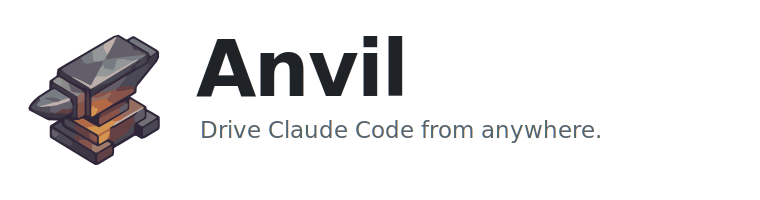
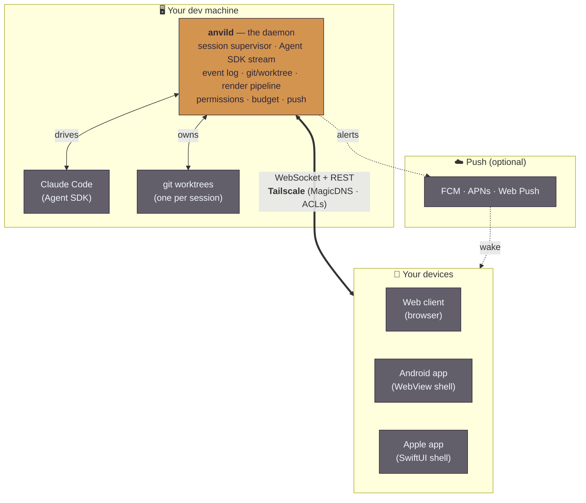
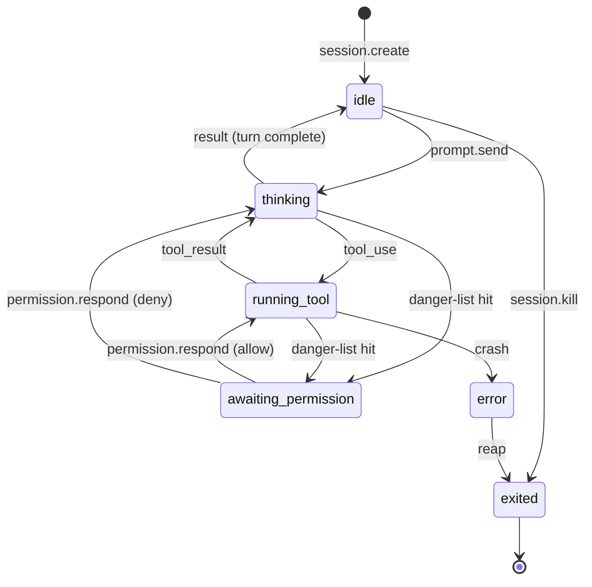
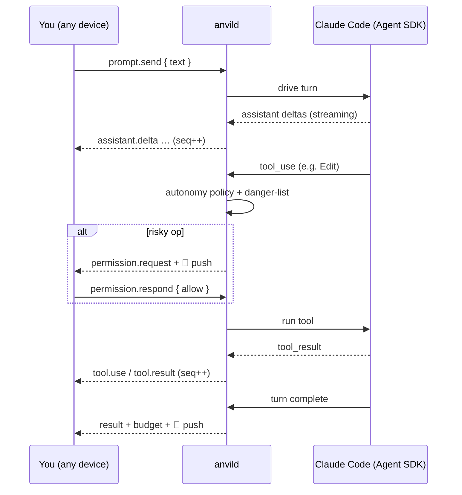
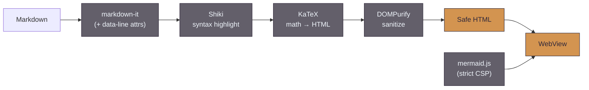

<p align="center">
  <picture>
    <source media="(prefers-color-scheme: dark)" srcset="docs/assets/anvil-banner-dark.svg">
    <source media="(prefers-color-scheme: light)" srcset="docs/assets/anvil-banner-light.svg">
    
  </picture>
</p>

<p align="center">
  <em>A native, multi-device client for <a href="https://www.claude.com/product/claude-code">Claude Code</a> — talk to your agent from your phone, tablet, or laptop, over your own private network.</em>
</p>

<p align="center">
  <a href="#quick-start">Quick start</a> ·
  <a href="docs/ARCHITECTURE.md">Architecture</a> ·
  <a href="#how-it-works">How it works</a> ·
  <a href="#repository-layout">Repo layout</a> ·
  <a href="#documentation">Docs</a>
</p>

---

## What is Anvil?

Anvil lets you **run Claude Code on your dev machine and drive it from anywhere** — your
phone on the couch, a tablet, or another laptop. A small daemon (`anvild`) supervises your
Claude Code sessions and streams them as **structured data** — markdown, tool calls, diffs,
git state — to thin native clients over [Tailscale](https://tailscale.com). Nothing is
public; your machine and your devices talk directly over your private tailnet.

It's the kind of thing you reach for when you want to kick off a task on your workstation,
put your phone in your pocket, and get pulled back by a push notification when Claude
finishes — or needs your permission for something risky.

> [!NOTE]
> **Anvil started life as a Zellij-in-a-WebView app and was rebuilt from the ground up.**
> The old approach scraped a terminal grid; the current one drives Claude Code through the
> [Agent SDK](https://docs.claude.com/en/docs/claude-code/sdk) and forwards typed events.
> See [Why a rebuild?](#why-a-rebuild) and [`docs/plans/anvil-native-architecture.md`](docs/plans/anvil-native-architecture.md).

### What you get

- 💬 **Conversation, not a terminal grid** — reflowable markdown, syntax-highlighted code,
  tables, math, and **mermaid diagrams**, rendered once on the daemon and shown identically
  on every device. Proportional fonts, real text inputs (Shift+Enter is a newline).
- 📱 **Multi-device, no shared viewport** — pick up your phone mid-conversation and it
  reconciles to exactly where your laptop left off. No "disconnect the other client" dance.
- 🌳 **Worktree-per-session** — each task can spin up its own git worktree off a base branch.
  Branch, diffstat, and git lifecycle (commit / push / PR / merge) are first-class.
- 🛡️ **Mostly-autonomous with a danger-list backstop** — auto-allows ordinary tool use,
  prompts only on genuinely risky ops (`rm -rf`, force-push, secret access). Per-session
  autonomy runs from `bypass` through `mostly-autonomous`, `allowlist`, to `prompt-all`;
  pick a model per session (`opus` · `sonnet` · `haiku` · `fable`). Permission prompts and
  Claude's own multiple-choice **questions** become native dialogs answerable from any device.
- 🤖 **Autopilot** — connect a Todoist project and Anvil bundles your tasks into units of
  work, writes an implementation plan for each (optionally red-teamed by a panel of
  independent models), and can run **overnight on a schedule** — kicking off build sessions
  and filing a run report back to your journal ([lapo](docs/lapo-integration.md) / Logseq).
- ⚔️ **Adversarial dev pipeline** — an opt-in, fully unattended path where two decorrelated
  models (Claude for design/judgment, GLM for agentic work) take a task through a
  requirements → design → implement → verify → validate gauntlet and open a PR, with a
  Design History File as the PR body.
- 🔔 **Push when it matters** — a notification when a session needs a decision or a turn
  completes. Web Push today; FCM (Android) / APNs (Apple) for native shells.
- 🖥️ **A real terminal when you need one** — a persistent, server-side PTY per session,
  with durable scrollback across device switches.
- 📄 **Live markdown reader** — open a doc and chat about it side-by-side; it re-renders in
  place as Claude edits it, with select-to-cite back into the conversation.
- 📎 **Attachments & deliverables** — drop images, PDFs, and files into a turn; generated
  reports/archives/media come back as download cards (with best-effort Tailscale Taildrop).
- 🧩 **Reusable prompts & skills** — a device-synced prompt library in the composer, plus
  `/`-autocomplete for your Claude Code user/project skills.
- 🔗 **Fleet-ready** — one client can manage `anvild` across several machines on one Max plan,
  with a persistent **concierge** session that can see and spin up work across the fleet. Macs *and*
  headless Linux boxes can join: a machine with no login boots into a setup screen in its own web UI,
  shows a 6-digit code, and the hub pushes the fleet's credentials over the tailnet.

---

## Quick start

You need a machine with [Bun](https://bun.sh) ≥ 1.3.14, a Claude **Max** subscription, and
[Tailscale](https://tailscale.com) on every device you want to drive from.

```sh
# 1. Install dependencies
cd anvild
bun install

# 2. Authenticate with your Claude subscription (one-time).
#    This uses the subscription pool — NOT a metered API key (see "Auth & billing" below).
export CLAUDE_CODE_OAUTH_TOKEN="$(claude setup-token)"

# 3. Run the daemon — serves the web client + WebSocket API on :7701
bun run start
#    → open http://localhost:7701
```

Then expose it to your other devices over Tailscale:

```sh
tailscale serve --bg --https=443 http://localhost:7701
#    → open https://<your-magicdns-host>/  from your phone or tablet
```

For an always-on install (macOS LaunchAgent that restarts on crash and at login), and a
non-technical, terminal-free setup, see [Running it for real](#running-it-for-real).

> [!IMPORTANT]
> **Auth & billing is a hard constraint.** Anvil only ever drives Claude through the Agent
> SDK, authenticated by your subscription's OAuth token. `ANTHROPIC_API_KEY` /
> `ANTHROPIC_AUTH_TOKEN` **must be unset** — a stray API key silently switches every turn to
> metered pay-per-token billing, so the daemon **refuses to start** if one is present.
> Full rationale: [`anvil-native-architecture.md` §3](docs/plans/anvil-native-architecture.md).

---

## System overview

A single daemon on your dev box hosts Claude Code and forwards structured events; thin
native shells render them. Everything between them rides your private tailnet.



`anvild` replaces **both** the old Python status server *and* Zellij — it owns the session
lifecycle end-to-end, so there are no sockets to negotiate or husk processes to reap.

---

## How it works

### A session is one conversation against one working tree

You create a session by pointing it at an **existing directory** (a quick poke) or asking
for a **fresh git worktree** off a base branch (an isolated task). The daemon spawns a
supervised Claude Code process in its own process group, records the session, and persists
an append-only event log that is the source of truth for replay.



### A turn, end to end

Every server→client event carries a per-session monotonic `seq`, which is the backbone of
resume: a client persists the highest `seq` it has rendered and, on reconnect, asks the
daemon to replay everything newer (or sends a full snapshot if the client is too far behind).



### Why markdown is rendered on the daemon

Markdown (chat bubbles **and** the reader pane) is rendered **once, in the daemon**, and
displayed in a scoped, read-only WebView in the native shells:



This buys **one** rendering pipeline across web/Android/Apple (mermaid, math, and
select-to-cite all work) instead of maintaining divergent native renderers. The native
shells still own everything else: navigation, layout, lists, input, terminal, and file tree.
Full reasoning in [`anvil-native-architecture.md` §8.3](docs/plans/anvil-native-architecture.md).

---

## Components

| Component | Path | Stack | What it is |
|---|---|---|---|
| **Daemon** | [`anvild/`](anvild/) | TypeScript · Bun | Session supervisor, Agent SDK streaming, event log, git/worktree ops, permissions, budget, render pipeline, push, autopilot + adversarial pipeline, and the Todoist/lapo/OpenRouter integrations. The keystone. |
| **Web client** | [`anvild/web/`](anvild/web/) | Vanilla TS | The daily-driver UI and the reusable render surface, served by the daemon at `/`. Also bundled into the native shells. |
| **Android app** | [`app/`](app/) | Kotlin | A WebView shell hosting the web client over Tailscale + native FCM push, ADB-over-Tailscale, offline app-shell. `com.gte619n.anvil`. |
| **Apple app** | [`apple/`](apple/) | SwiftUI · WKWebView | macOS-first hybrid shell (same model as Android); iOS + APNs gated on an Apple Developer account. |
| **Server control panel** | [`anvil-server/`](anvil-server/) | SwiftUI | A macOS menu-bar app that stands up and manages `anvild` and joins Macs into a fleet — terminal-free setup. Non-Mac machines join from the daemon's own web UI instead. |
| **Build & release scripts** | [`scripts/`](scripts/) | Bash · TS | CI release notes + Apple Developer ID signing. |

---

## Running it for real

The daemon is built to run unattended on a macOS LaunchAgent.

```sh
cd anvild
./scripts/service.sh install     # build web, install + load the LaunchAgent, wire tailscale serve
./scripts/service.sh status      # service state + /api/health
./scripts/service.sh restart     # kickstart past launchd backoff
./scripts/service.sh logs        # tail the daemon log
```

It installs a launcher that sources `~/.config/anvil/env`, strips any
`ANTHROPIC_API_KEY` / `ANTHROPIC_AUTH_TOKEN` from the environment, runs at login, and
restarts on crash. No secrets live in the plist. See [`anvild/README.md`](anvild/README.md).

For a **terminal-free** setup on a Mac — install Bun, capture the OAuth token, wire Tailscale, and
join several Macs into a fleet from a menu-bar UI — use the **Anvil Server** app in
[`anvil-server/`](anvil-server/).

### Headless / Linux machines

`service.sh install` no longer requires a Claude login up front. With no token the daemon starts
**degraded**: it serves its API and web UI and reports `subscriptionAuthOk: false`, but refuses agent
turns (terminal, files, and git keep working). Open that machine's own web UI over Tailscale —
`https://<machine>.<tailnet>.ts.net:7701` — and it takes the screen over with a setup flow:

- **Join a fleet** → shows a 6-digit code. On an existing machine, go to
  **Settings → Servers → Add a machine**, pick this one (it's labelled *needs setup*), and enter the
  code. The hub pushes its Claude login — plus the Todoist/OpenRouter keys — over the tailnet.
- **Enter a token directly** → paste a `claude setup-token` value for a standalone machine.

Nothing after the one-time `install` needs a terminal. **The setup screen is browser-only in this
release** — the Android/iOS/macOS apps bundle their own copy of the web UI, so they need an app update
before it appears there; point a browser at the machine instead. Details:
[`docs/plans/anvil-headless-join.md`](docs/plans/anvil-headless-join.md).

---

## Why a rebuild?

The original Anvil drove Claude Code inside a PTY, inside Zellij, surfaced through Zellij's
browser web client, wrapped in a WebView. Nearly every frustration traced to one root cause:
**using a terminal multiplexer for something that isn't fundamentally terminal work.**

| Pain point (Zellij era) | Root cause | Fixed by |
|---|---|---|
| Monospace prose hard to read | bytes-on-a-grid | structured markdown, proportional fonts |
| Shift+Enter ≠ newline | terminal key encoding | native text inputs |
| Viewport fights across devices / foldables | one shared character grid | reflowable structure, no shared viewport |
| Can't paste/drag images & files | a PTY only takes byte streams | first-class structured attachments |
| Sessions opaque, won't die | Zellij owned lifecycle via sockets/husks | daemon owns lifecycle + process-group kill |
| All tabs/titles look identical | no structured metadata | rich session list with previews + git state |

The reframe: **Anvil is a Claude client that occasionally needs a terminal**, not a
terminal that occasionally talks to Claude. The full design — including the load-bearing
auth/billing constraint and the protocol — lives in
[`docs/plans/anvil-native-architecture.md`](docs/plans/anvil-native-architecture.md).

---

## Repository layout

```
anvil/
├── anvild/              # 🔨 the daemon (TS/Bun) — the keystone
│   ├── src/             #    server · session · agent · render · git · push · fleet …
│   │                    #    integrations (autopilot · Todoist · lapo · schedule) · pipeline · prompts
│   ├── web/             #    the web client + render surface (served at /)
│   ├── protocol.ts      #    → symlink to docs/plans/anvil-protocol.ts
│   └── scripts/         #    service.sh (LaunchAgent), merge-session.sh
├── app/                 # 🤖 Android WebView shell (Kotlin) — com.gte619n.anvil
├── apple/               # 🍎 Apple SwiftUI WebView shell (macOS first)
├── anvil-server/        # 🖥️  macOS menu-bar control panel for anvild + fleet
├── docs/
│   ├── ARCHITECTURE.md  #    approachable overview with diagrams (start here)
│   ├── assets/          #    brand assets (logo, banners)
│   └── plans/           #    deep design + implementation specs
├── scripts/             #    build/release utilities (CI release notes, Apple signing)
└── .github/workflows/   #    CI gate + "full release" (Firebase, TestFlight, Sparkle) on merge to main
```

---

## Documentation

| Doc | What's in it |
|---|---|
| [`docs/ARCHITECTURE.md`](docs/ARCHITECTURE.md) | **Start here.** Approachable architecture tour with diagrams. |
| [`docs/plans/anvil-native-architecture.md`](docs/plans/anvil-native-architecture.md) | The full design: auth/billing, sessions, protocol, render pipeline, decisions. |
| [`docs/plans/anvil-protocol.ts`](docs/plans/anvil-protocol.ts) | The wire protocol — every envelope, event, and command (the source of truth). |
| [`docs/plans/anvil-impl-INDEX.md`](docs/plans/anvil-impl-INDEX.md) | Index of the per-component implementation plans. |
| [`docs/plans/anvil-multi-server.md`](docs/plans/anvil-multi-server.md) | Multi-server fleet design (one client, many Macs, one Max plan). |
| [`docs/plans/anvil-headless-join.md`](docs/plans/anvil-headless-join.md) | Tokenless boot + joining a fleet from a headless (non-Mac) machine. |
| [`docs/plans/anvil-server-app.md`](docs/plans/anvil-server-app.md) | The menu-bar control panel design. |
| [`docs/plans/anvil-autopilot-ui.md`](docs/plans/anvil-autopilot-ui.md) · [`anvil-todoist-integration.md`](docs/plans/anvil-todoist-integration.md) | Todoist autopilot + the plan-review UI. |
| [`docs/plans/anvil-adversarial-pipeline.md`](docs/plans/anvil-adversarial-pipeline.md) | The OpenRouter/GLM adversarial planning panel + the unattended dev pipeline. |
| [`docs/lapo-integration.md`](docs/lapo-integration.md) | Posting autopilot run reports to a lapo/Logseq journal over OAuth2. |
| [`docs/CI-CD.md`](docs/CI-CD.md) | The build & release pipeline — every target, what to push to ship it. |
| [`anvild/README.md`](anvild/README.md) | Running, building, and developing the daemon + web client. |
| [`app/README.md`](app/README.md) · [`apple/README.md`](apple/README.md) · [`anvil-server/README.md`](anvil-server/README.md) | Android + Apple clients and the control-panel build notes. |

---

## License

MIT
